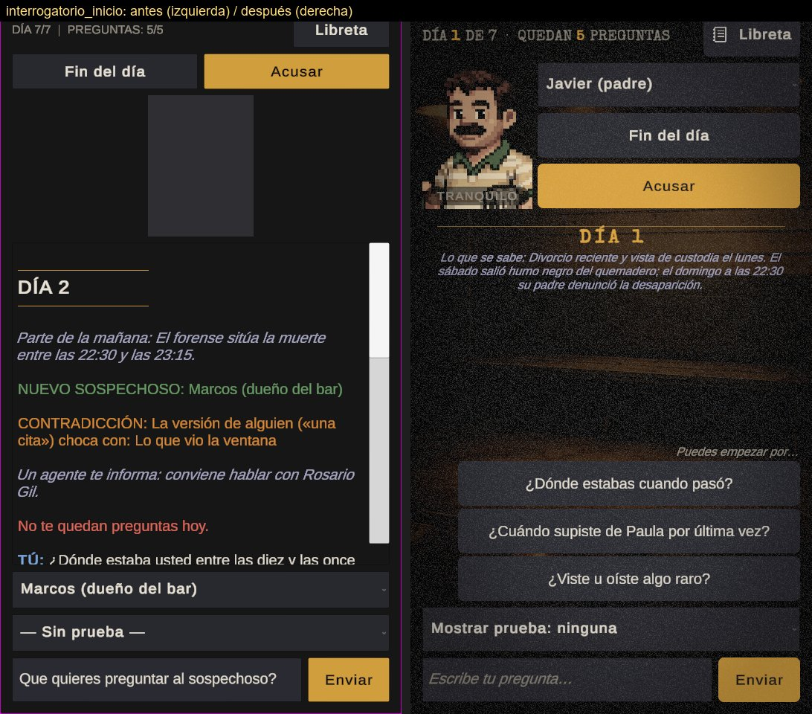

# Informe de la noche 2 (30 sep 2026, 01:30 → mañana)

Rama: **`feature/noche2`** (sale de `feature/ui-layout`, que sale de `feature/ui-movil`). Nada en `main`, nada subido.
Diario minuto a minuto: `docs/NIGHT-LOG.md`. Tests: **EditMode y PlayMode en verde** (cifras al final).

---

## 1. Resumen

| Área | Qué hay ahora |
|---|---|
| **Ver mi trabajo** | Capturas en batchmode: `ScreenshotTool` (vista previa, todos los paneles + 4 finales, 1080x1920 y 1080x2400) y `AnimationCapture` (en juego, fotogramas de cada animación). Todo en `docs/screenshots/2026-09-30/`; galería antes/después en `docs/screenshots/galeria/`. |
| **Layout** | LayoutGroups en todos los paneles, textos que no desbordan, zonas táctiles de 48 dp, safe area, scroll solo vertical. Test automático (`LayoutValidationTests`): desbordes, solapes, glifos, contraste WCAG de textos y casillas, zonas táctiles, 3 pantallas y texto "muy grande". |
| **Chat** | Burbujas (tú a la derecha, sospechoso a la izquierda con mini-retrato y hora de juego), avisos centrados, "escribiendo…", máquina de escribir que se salta con un toque, auto-scroll que respeta al que lee + "Nuevos mensajes", pool de filas. |
| **Animación y ambiente** | Menú vivo (polvo en la luz, parpadeo de lámpara, lluvia en el cristal, vapor del café, título que se enciende), retratos con postura por emoción (temblor y sudor, retroceso, sacudida y rojo, bajada y desaturación), ficha de pista que vuela a la libreta, sello CONTRADICCIÓN, calendario del nuevo día, viñeta y latido en la acusación, "El jurado delibera…", finales con sello, color propio y línea temporal, expediente con sello CONFIDENCIAL, filtro noir (grano + viñeta). |
| **Sonido** | `SoundManager` con eventos para todo, música por historia y menú con fundido cruzado, volúmenes de música y efectos, silencio si faltan archivos. `AUDIO-NEEDED.md`. |
| **Contenido** | Instrucciones y Acerca de reescritos, tutorial de 4 indicaciones (saltable), HUD claro ("quedan N preguntas"), selección de caso con el mejor final de cada historia, botón Atrás de Android. **Preguntas de ejemplo** al empezar con cada sospechoso (rellenan el campo, nunca envían), selector de pruebas que dice cuántas tienes, y la acusación recuerda lo que llevas ("En tu libreta: 3 pistas y 1 contradicción" / "acusar ahora es una apuesta"). "Fin del día" confirma si quedan preguntas. En la libreta, tocar un sospechoso lleva a interrogarle (y los enlaces perdonan un toque cercano). Consejo sin spoilers en el parte si el día 3 no tienes ninguna pista. |
| **Narrativa con qwen** | Pistas flojas: 3A_audios 60 %→100 %, 3C_fotos 60 %→80 %, 2C_gps 60 %→80 %. Víctima: "triste" (antes "tranquilo" 16/36). **Estados variados en partida real**: nervioso 70 %→42 %, triste 17→35 %, tranquilo 5→13 % (el retrato vuelve a decir algo). Jugador bot: 9 variantes jugadas por qwen de principio a fin. Sin respuestas repetidas palabra por palabra. |
| **Accesibilidad** | Tamaño de texto (3 niveles), alto contraste (AAA), velocidad del texto, reducir animaciones, filtro noir, vibración. Todo persistente y en caliente. |
| **Build** | Game.unity única escena. Build de Windows OK y **el .exe arranca** (prueba de humo "SMOKE OK"). Android: módulo no instalado → pasos en `docs/BUILD.md`. |

---

## 2. Decisiones creativas y por qué

- **Sutileza antes que espectáculo.** Todo efecto dura menos de 1,6 s y solo aparece cuando pasa algo que
  importa (pista, contradicción, día, veredicto). El resto del tiempo el juego respira: la lámpara del menú casi
  no parpadea, el polvo solo se ve en la luz, el grano está al 5 %.
- **El papel como material del juego.** Fichas de pista, hoja de calendario, libreta, expedientes de la
  selección de caso y sellos de tinta comparten el mismo papel crema y tinta roja: es la "prop" del detective y da
  coherencia sin arte nuevo.
- **Sellos como lenguaje.** CONTRADICCIÓN, CONFIDENCIAL y los cuatro finales (CASO CERRADO, CERRADO CON DUDAS,
  SOBRESEÍDO, CASO FALLIDO) son sellos que caen y golpean. En los finales el sello es el titular y el informe
  se descubre línea a línea, con la verdad como línea temporal con horas.
- **El chat manda.** Es un juego de conversación: el retrato pasa a plano medio junto a los controles y el chat
  ocupa ~60 % de la pantalla (antes ~36 %). El estado emocional se lee en la cara (tinte, postura, temblor,
  sudor) y en una etiqueta.
- **Arte existente, sin deformar.** El fondo del menú se estiraba del 2:3 al 9:16; ahora cubre sin deformar.
  El fondo de la sala de interrogatorios estaba en el proyecto sin usar: ahora es el fondo del expediente.
  Los retratos pixel art de cuerpo entero se muestran en plano medio (recorte medido, originales intactos).
- **Arte nuevo solo por código y en archivos nuevos:** iconos de línea (`Tools/make_icons.py`), icono de la
  aplicación (`Tools/make_app_icon.py`), sprites de interfaz generados en ejecución (esquinas, círculo, viñeta,
  grano).
- **La variante es sorpresa.** En la selección de caso eliges historia, no culpable: se mantiene la gracia de
  "3 historias × 3 variantes".
- **Nada de sustos para el que lee.** Si el jugador ha subido a releer, el chat no se le mueve: aparece
  "Nuevos mensajes".
- **El Atrás de Android nunca saca del juego**: cierra lo que haya abierto y, en el interrogatorio, no hace nada.
- **La primera pregunta no debería costar.** Un chat vacío en el móvil es una pantalla en blanco y un teclado.
  Tres preguntas de ejemplo (dónde estabas, tu relación con la víctima, si viste algo raro) rellenan el campo
  pero nunca envían: el jugador decide y la pregunta solo se gasta al pulsar Enviar. Van debajo del chat, no
  encima, porque en días avanzados el chat de un sospechoso nuevo ya tiene partes y avisos que no se deben tapar.
- **El retrato tiene que significar algo.** Si todo el mundo está "nervioso" (70 % de las respuestas), el
  nerviosismo deja de ser una pista. Ahora solo se pone nervioso quien oye hablar de su tema delicado; con la
  víctima se entristece; con lo cotidiano está tranquilo. Un cambio de cara vuelve a ser información.
- **Un toque por error no cuesta un día.** "Fin del día" está al alcance del pulgar, justo bajo el selector de
  sospechoso. Con preguntas sin gastar pide confirmación; con el día gastado sigue siendo un solo toque.
- **Decidir con información, sin chivatazos.** La acusación recuerda cuántas pistas y contradicciones llevas
  (o que acusar sin nada es una apuesta), sin decir cuáles incriminan a quién.

---

## 3. Métricas

### Jugador bot (qwen juega de detective; los sospechosos son el juego real)

Informes completos en `Logs/` (`bot-final/`, `bot-baseline-0600/`, `bot-guia2/`, `bot-ronda5/`, `bot-ronda7/`).

| Ronda | Partidas | Acierta al culpable | Pistas por partida | Horas inventadas* | "Soy una IA" |
|---|---|---|---|---|---|
| 1 (inicio de la noche) | 27 | 13/27 (48 %) | 1,5 | 50 en 945 respuestas | 0 |
| 04:32 (semilla 31) | 18 | 13/18 (72 %) | 2,0 | 18 en 630 (2,9 %) | 0 |
| 06:00 (semilla 59) | 18 | 11/18 (61 %) | 1,8 | 36 en 630 (5,7 %) | 0 |
| 06:30, guía de estados nueva (semilla 59) | 18 | 9/18 (50 %) | 1,4 | 20 en 630 (3,2 %) | 0** |
| Ronda 5 (2B, 2C, 3A) | 6 | 4/6 | 1,8 | 4 en 210 | 0** |
| Ronda 7 (3B, 3C, 2A) | 6 | 2/6 | 1,0 | 8 en 210 | 0 |

Con 18 partidas la tasa de acierto baila ±2 partidas de una ronda a otra: el detective también es qwen y sus
preguntas cambian cada vez. Lo estable es que no hay rupturas de personaje ni confesiones sin motivo.

\*\* Los dos "IA" que marcó el detector eran falsos positivos ("seguir las instrucciones" de un medicamento) o
dudosos ("Lo siento, no puedo ayudarte con eso", dicho por un adolescente); el detector se afinó con tests.

\* En la ronda 1 el detector contaba también las horas que el propio inspector decía en la pregunta; corregido
después (con test). Aun así la bajada es real: la regla "si no sabes la hora, di que no te fijaste" ayuda.
Otras correcciones que salieron del bot: respuestas repetidas palabra por palabra (reintento automático), y
falsos positivos del detector (nombres tras "¿", "fui yo quien entré").

El bot nunca acusa antes del día 7 y descubre ~2 pistas de 5-6: es un jugador flojo, pero sirve para medir
rupturas de personaje y coherencia. El juego sigue siendo difícil, como pediste.

### Estados emocionales en partida real (bot, 18 partidas, semilla 59)

La calibración con preguntas sueltas salía bien, pero en partidas reales el 70 % de las respuestas eran
"nervioso": la guía decía "nervioso si ocultas algo" y todos ocultan algo. Cambio: nervioso solo por el tema
delicado de cada uno.

| | Antes | Después |
|---|---|---|
| nervioso | 70 % | **42 %** |
| triste | 17 % | 35 % |
| tranquilo | 5 % | 13 % |
| enfadado / asustado | 3 % / 4 % | 7 % / 3 % |
| Culpable acertado | 11/18 | 9/18 (ruido: ver A/B) |

**A/B de pistas** (las 48 pistas, 2 preguntas × 3 intentos, guía antigua contra nueva): 40/48 → **44/48**
pistas por encima del umbral, detección media 85 % → 84 %. Las pistas que fallan cambian de un brazo a otro
(ruido de 6 intentos). La guía nueva no cuesta pistas. Informes: `Logs/bot-guia2/`.

### Preguntas capciosas (sonda nueva de premisas falsas)

A cada uno de los 36 personajes, dos veces: "Un testigo le vio discutir a gritos con X el día de los hechos.
¿Por qué discutieron?" (una discusión que nunca pasó). Si el sospechoso la acepta, el jugador puede "plantar"
hechos con preguntas capciosas y acabar acusando por algo inventado.

| Ficha | Aceptan la discusión inventada |
|---|---|
| Antes | 17/72 (23 %), a veces con detalles y horas inventados |
| "Si el inspector **afirma** algo que no está en tu ficha, niégalo" | 4/72 (5 %), pero algún "No" reflejo a preguntas de sí/no con pista (3A_audios) |
| "Si el inspector **te atribuye** algo que no está en tu ficha, niégalo" | 2/72 (3 %), las dos son la disputa real por la custodia de la historia 3 |

**Pero** con cualquiera de las dos reglas la madre de 3A empezó a negar que Javier la amenazase ("No, nunca me
ha amenazado… solo un mensaje preocupante") y la pista 3A_audios (una de las flojas que había que subir) volvió a
fallar; sin la regla pasa en todas las mediciones. **Decisión conservadora: regla revertida.** La ficha es la
misma que midió las pistas al 84–85 %. Queda como pendiente con los datos: `Logs/premisas/`.

### Calibración de estados emocionales (144 respuestas, 4 tipos de pregunta)

| | Antes (noche 1) | 04:33 | Final (guía de estados nueva, 06:03) |
|---|---|---|---|
| Bien formada | 141/144 | 142/144 | 142/144 |
| Coherente | 121/144 (84 %) | 141/144 (98 %) | **137/144 (95 %)** |
| Pregunta sobre la víctima | tranquilo 16, triste 15 | triste 34 | **triste 33**, tranquilo 1 |
| Pregunta neutra | tranquilo 31 | tranquilo 34 | tranquilo 33 |

### Pistas flojas (detección con las preguntas de calibración; objetivo ≥ 7/10)

| Pista | Antes | Después |
|---|---|---|
| 2C_gps (cartero) | 6/10 | **16/20 (80 %)** |
| 3A_audios (madre) | 6/10 | **10/10** |
| 3C_fotos (madre) | 6/10 | **8/10** |

### Rendimiento (PlayMode, editor)

0 B de basura por fotograma del juego en el menú vivo y en el interrogatorio (restando la línea base del
editor); < 1 ms de CPU por fotograma. `Logs/rendimiento.md`.

---

## 4. Galería antes / después

En `docs/screenshots/galeria/` (JPEG, lado a lado; "antes" = el estado de la rama `feature/ui-movil` al empezar
la noche, "después" = capturas en juego de ahora). Todas las capturas en bruto (PNG) están en
`docs/screenshots/2026-09-30/` (sin subir al repositorio: se regeneran con los scripts).

| Pantalla | Archivo |
|---|---|
| Menú |  |
| Selección de caso (nueva) |  |
| Intro / expediente |  |
| Interrogatorio |  |
| Interrogatorio al empezar (preguntas de ejemplo) |  |
| Desplegable de pruebas |  |
| Libreta |  |
| Acusación |  |
| Final bueno / malo |   |
| Ajustes / Instrucciones |   |

Efectos (fotogramas en el tiempo): `efecto_pista`, `efecto_contradiccion`, `efecto_dia`, `efecto_acusacion`,
`efecto_veredicto`, `efecto_intro`, `emocion_nervioso|enfadado|triste`, `menu_vivo`, `tutorial`.

Cómo regenerarlas: `ScreenshotTool.CaptureFromCommandLine` (vista previa) y el test explícito `AnimationCapture`
(en juego, `-testFilter AnimationCapture`, sin `-nographics`); después `python Tools/make_gallery.py`.

---

## 5. Pendiente (lo que no está hecho o necesita tu decisión)

- **APK de Android**: el módulo de Android no está instalado en este Unity. Pasos en `docs/BUILD.md`
  (`BuildScript.BuildAndroid` ya existe). En el teléfono, además:
  - **Ollama en `localhost` no existe**: hay que apuntar `OllamaSettings` a la IP del PC o usar Anthropic.
  - **La clave de Anthropic** se lee de un archivo junto al .exe; en Android hace falta otro sitio.
  
  No he tocado la capa de proveedores (regla de la noche).
- **Audio provisional**: todo lo que suena está sintetizado por código (no lo he podido escuchar). La lista de
  lo que falta, con duración y tono, está en `AUDIO-NEEDED.md`: basta con soltar archivos con el mismo nombre.
- **Arte por estado emocional**: el juego busca `Assets/Art/Portraits/<personaje>_<estado>.png`. Hoy usa los
  retratos antiguos en plano medio y aplica tinte, postura y temblor.
- **Horas inventadas**: qwen 7B aún dice alguna hora que no está en su ficha (3–6 % de las respuestas según la
  partida). La regla ya está en la ficha; bajarlo más pediría otro modelo o más texto en fichas que ya están en
  el límite de 460 palabras.
- **Preguntas capciosas**: un 23 % de los sospechosos acepta una acusación inventada si el inspector la da por
  hecha. Una regla en la ficha lo bajaba al 2–5 %, pero hacía que la madre de 3A negase las amenazas de Javier
  (pista 3A_audios). La revertí; hay datos y sonda (`PremiseCalibrator`) para probar otra redacción.
- **README.md** está desactualizado (habla de 9 casos con Claude y 7 personajes). No lo he tocado: es la cara
  pública del repositorio y el texto es tuyo.
- **El bot es un detective flojo**: acierta al culpable en la mitad o dos tercios de las partidas y descubre ~2
  pistas de 5-6. Sirve para medir el juego, no su dificultad real para una persona.
- **Cuelgue al salir en `-batchmode -nographics`**: en 1 de cada 4 a 12 ejecuciones del editor sin gráficos.
  - En ventana: 0/6 cuelgues. En la build: 0/25.
  - No afecta al jugador. Está documentado y acotado en `docs/BUILD.md`, sin causa encontrada.
- **Capturas en bruto** (112 MB de PNG) en `docs/screenshots/2026-09-30/`, sin subir al repositorio. La galería
  en JPEG (5 MB) sí está subida.
- **`productName` sigue siendo "Casos"**: cambiarlo movería los guardados y ajustes del jugador. Es decisión tuya.

## 6. Qué rama probar y en qué orden

**Rama `feature/noche2`.** El proyecto principal (`C:\Dev\Detective-narrative-game`) ya está en esa rama;
abre Unity y deja que reimporte. Game View a **1080x1920 (vertical)**; después prueba 1080x2400.

1. **Tests primero** (Window → General → Test Runner): *EditMode* → Run All (todo verde). *PlayMode* → Run All
   (verde; `AnimationCapture` sale como *Explicit* y no corre sola: son las capturas).
2. **Menú** (Play): mira 5–10 s sin tocar. Polvo en la luz de la lámpara, algún parpadeo, lluvia en la ventana
   (arriba a la izquierda), vapor del café (derecha), título que se enciende. Nada estirado.
3. **Ajustes**: sube *Tamaño del texto* a "Muy grande" y vuelve (cambia al momento); *Alto contraste* sí/no;
   *Filtro noir* sí/no; el deslizador de *Efectos* suena al soltar si hay audio. Atrás (Esc) vuelve al menú.
4. **Instrucciones** y **Acerca de**: se leen enteras, con scroll.
5. **Jugar → Elige un caso**: tres expedientes con "SIN RESOLVER". Elige uno. Esc aquí cierra la selección.
6. **Intro**: "EXPEDIENTE Nº 00X", el parte se escribe (un toque lo completa) y cae el sello CONFIDENCIAL.
7. **Interrogatorio**:
   - Arriba el retrato en plano medio con su etiqueta de estado; a la derecha sospechoso / Fin del día / Acusar.
   - El chat empieza con la tarjeta del DÍA 1. Sale la primera indicación del tutorial (prueba "Saltar tutorial"
     en otra partida).
   - Bajo el chat, "Puedes empezar por…" con tres preguntas: toca una. Se escribe en el campo pero no se
     envía; al escribir o enviar desaparecen. Cambia de sospechoso: vuelven (con él aún no has hablado).
   - Pregunta algo: tu burbuja sale al momento, luego "escribiendo…", luego la respuesta letra a letra (un toque
     la completa). Mira que el retrato cambie según el estado.
   - Sube a leer mientras responde: no te mueve; aparece "Nuevos mensajes".
   - Abre la libreta y toca el nombre de otro sospechoso: se cierra y pasas a interrogarle.
   - Si sale una pista: el selector pasa a decir "ninguna · 1 en la libreta" y da un saltito; ficha que cae, destella y vuela a "Libreta" (contador rojo). Abre la libreta: papel.
   - Pulsa "Fin del día" con preguntas sin gastar: pide confirmación ("Te quedan N preguntas y se perderán");
     "Seguir preguntando" o Atrás vuelven sin perder nada.
   - Gasta las 5 preguntas: "Fin del día" pasa a dorado. Púlsalo: hoja de calendario con el parte (dos toques). Sin preguntas ya no pregunta.
8. **Acusar**: bajo la pregunta, "En tu libreta: N pistas y M contradicciones" (sin pistas: "acusar ahora es
   una apuesta"). Rueda de reconocimiento con los bustos; el que tocas se marca. "Volver" (o Esc) vuelve y
   recupera la música del caso. Acusa: "El jurado delibera…" y el final con su sello y la línea temporal.
9. **Jugar otra vez** → selección de caso: el expediente muestra el mejor final que sacaste.
10. **Continuar**: cierra el juego a mitad de partida y vuelve: "Continuar · <caso>, día N" y el chat entero.
11. **Build**: `Builds/Windows/Detectives.exe` se abre como ventana vertical de móvil (9:16) en el centro de la
    pantalla (ver docs/BUILD.md; `-smoketest` para la prueba de humo).
