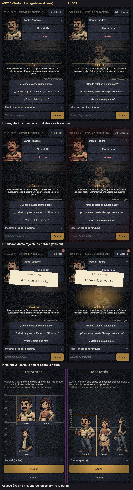

# Informe — Sesión A: feedback de Cristian tras jugar (01-10-2026)

Rama `feature/sesion-a` (sale de `feature/dia3`), cuatro bloques en orden, un commit y push por bloque. **`main` sin
tocar.** Ollama local con qwen2.5:7b-instruct, sin cambiar de proveedor ni tocar su capa. Arte original intacto: todo
lo nuevo está en archivos nuevos. Detalle hora a hora en `docs/NIGHT-LOG.md` (# Sesión A).

| Bloque | HECHO CUANDO | Resultado | Commits |
|---|---|---|---|
| 1. "Recuerdan la partida anterior" | tests en verde y el bot juega 2 partidas sin fuga | ✓ 0 fugas; causa real encontrada y corregida | `aee37cd`, `d5beb9d` |
| 2. Lógica de las 48 pistas | pistas ≥ 80 %, premisas ≤ 5 %, estados ≥ 95 %, bot ≥ 14/18 | ✓ 83 % · 1 % · 95 % · 14/18 | `a4c13dd` … `a4b0401` |
| 3. Personajes sin retrato propio | retratos derivados, galería, honestidad, prompts | ✓ 12 personajes, 12 retratos | `450abf5` |
| 4. Gráficos | centro, rueda de alturas, animaciones, galería antes/después | ✓ | `1d11033` |

Tests al cerrar: **EditMode 740/740, PlayMode 64/64** (más 24 capturas y mediciones, ignoradas como siempre).

## Bloque 1 — los sospechosos "recuerdan" la partida anterior

- **Reproducción primero.** Tests de juego con un proveedor falso que guarda todo lo que llega al modelo: partida 1
  con un marcador ("ZAFIRO") y luego **Jugar otra vez**, **Reiniciar**, **Caso nuevo desde el menú** y **la misma
  historia otra vez**. En los cuatro casos, la partida 2 empieza con historiales vacíos y su prompt no contiene nada
  de la 1. **Continuar** conserva solo esa partida.
- **No había fuga en el código.** Lo comprobé además a mano: historiales, estado, notas, partes, proveedor (sin
  `context` de Ollama) y biblioteca de casos.
- **El bot** ahora juega partidas seguidas con el mismo gestor y comprueba que nada de la anterior llega al modelo:
  **0 fugas**.
- **Lo que vio Cristian, con datos.** El modelo dice "como ya le dije" sin haber hablado antes en el 0,8 % de las
  primeras respuestas (11 de 1 342). Si además la variante se repite, parece que recuerda. Arreglo, con test en rojo
  primero: en la primera conversación con un sospechoso, una respuesta que finge memoria se pide otra vez. El bot la
  marca como `FalseMemory` si aun así se cuela.

## Bloque 2 — lógica de las pistas

- **`docs/CLUE-LOGIC.md`**: tabla de las 48 pistas de las 9 variantes, con quién lo sabe y por qué, qué pregunta lo
  saca, cuándo es lógico y si la libreta lo explica. Al final están los cambios aplicados y las mediciones de después.
- **Rosario → Amparo.** Compartía nombre con una persona real del caso. Un test vigila todos los textos. La clave
  interna del arte (`rosario`) se queda, porque moverla sería tocar el arte original.
- **Arreglos de más peso:**
  - 3C: la pista se perdía con el ancla "despedir". Ahora se detecta en cualquier forma del verbo (test en rojo con
    los datos viejos).
  - Ruiz no sabía que tenía los registros de fichaje (2B).
  - Andrés no veía raros el bar a oscuras (2A) ni la comisaría cerrada (2C).
  - Las fichas de Álex contradecían sus pistas.
  - Los partes señalaban a la persona equivocada.
- **Medido:**
  - Pistas 41/48 (**83 %**). Con los retoques de anclas: 46/48.
  - Premisas inventadas: **1 %**.
  - Estados: **95 %**.
  - Bot: **14/18**.
- **Por debajo de 2/3:** 1B_cena (33 %) y 1C_llamada (56 %). Es comportamiento del modelo, no del detector.

## Bloque 3 — personajes sin retrato propio

- **Inventario:** 7 retratos para 12 personajes. Compartían cara:
  - Daniel y Javier
  - Carmen y Lucía
  - Lucas y Álex
  - las tres vecinas (Amparo, Maruxa y Encarna)
- **Seis derivados por código** (`Tools/make_derived_portraits.py` → `Assets/Art/Derived/`), con el original intacto:
  - recolor por zonas
  - canas
  - gafas para Lucía
  - luto para Encarna
  - espejo para los de la historia 3

  Mismo encuadre y mismo tratamiento de pixel art. Un test garantiza que ningún personaje comparte retrato.
- **Galería a tamaño real:** `docs/screenshots/2026-10-01/galeria/retratos_12.jpg` y `retratos_antes_despues.jpg`.
- **Honesto:** Javier comparte cara y bigote con Daniel, y las tres vecinas comparten cara y pose. Se distinguen por
  ropa, pelo y orientación, pero no son personajes nuevos. Hay prompts para arte de verdad en `ART-NEEDED.md`.

## Bloque 4 — gráficos

**Galería antes/después** (`galeria/graficos_antes_despues.jpg`): la misma pantalla, la misma historia (Caso 1) y los
mismos instantes en las dos columnas. "Antes" es el mismo juego con los tres ajustes nuevos del tema apagados, lo que
demuestra además que cada cambio se puede desactivar.

| Cambio | Qué hace | Ajuste del tema | Con "Reducir animaciones" |
|---|---|---|---|
| Escena central | Figura grande del sospechoso (de la cabeza a los muslos) detrás del chat, alfa 0,24 para no restar lectura | `interrogationStage`, `stageAlpha` | Igual (es estática) |
| Viñeta de tensión | Bordes oscuros según el estado; rojo oscuro si está enfadado | `tensionVignette` | Sin temblor; la viñeta se queda |
| Entrada al cambiar de sospechoso | Fundido y deslizamiento de figura y busto (medido: termina a los 0,6 s) | con la escena | Solo un fundido corto, sin moverse |
| Pista nueva | Destello ámbar suave sobre la figura y leve latido | con la escena | Sin latido |
| Contradicción | Sacudida pequeña del busto, junto al sello | — | Sin sacudida |
| Rueda de acusación | Una fila, cuerpo entero, **alturas reales** (150–183 cm) a la misma escala que la pared | `lineupSingleRow` | — |

**Cómo se verificó:**

- Tests en rojo antes de cada pieza: escena y viñeta (`InterrogationSceneTests`, tres de juego en
  `StateMachineTests`) y escala, huecos y rayas de la rueda (`HeightLineupTests`).
- Validación de maquetación a 16:9, 19,5:9, texto muy grande y alto contraste.
- Capturas fotograma a fotograma revisadas por mí. En la entrada medí brillo y posición para no fiarme de la vista.

**Lo que salió mal y corregí:**

- La primera viñeta roja teñía toda la pantalla, y el destello salía como una caja porque usaba el sprite equivocado.
- La rueda se salía de su sitio a 19,5:9. Fallaron dos intentos con eventos y el tercero (convertirla en
  LayoutGroup) llegó después de leer cómo cambia el tamaño la vista previa.
- Ocultaba rayas de la pared con `SetActive` dentro del cálculo de layout, y Unity lo rechazaba.
- Una hoja de revisión me engañó: era una miniatura vieja con el mismo nombre. Lo comprobé a tamaño real.

**Diferencia con el día 3 real:** en "antes", la pared marca 110–200 en vez de 130–190, porque amplié el rango para
todos.

## Pendiente y riesgos

- **Arte:** Javier y las vecinas siguen siendo variaciones del mismo dibujo. Los prompts están en `ART-NEEDED.md`.
- **Pistas débiles:** 1B_cena y 1C_llamada salen menos de 2 de cada 3 veces, por el modelo.
- **Medidas:** las alturas de la rueda son las del encuadre opaco de cada imagen. Si llega arte nuevo, hay que
  medirlas otra vez (las cifras están en `PortraitCrops.Figure`).
- **Galería:** las capturas `anim/` no van al repositorio (son ~200 PNG); se regeneran con
  `AnimationCapture.AntesDespues` y `python Tools/make_gallery_sesion_a.py`.
